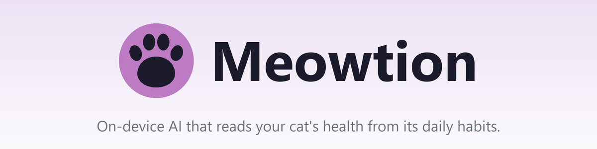
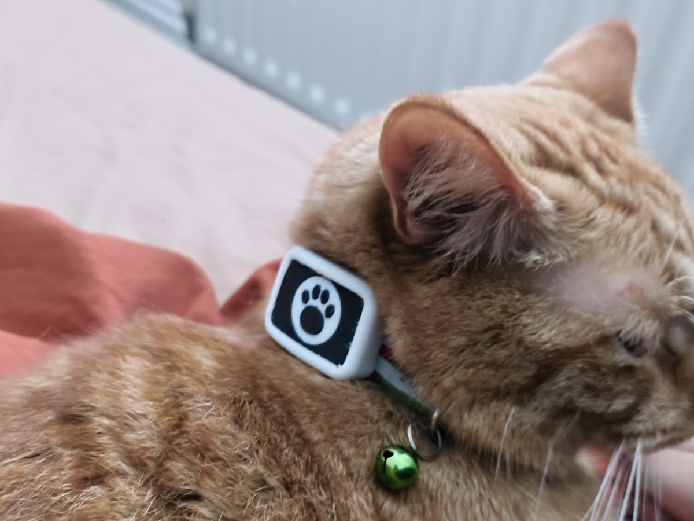
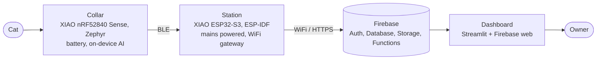

<p align="center">
  
</p>

<p align="center">
  <a href="https://meowtion.streamlit.app"><b>🐾 Live dashboard</b></a>
  &nbsp;·&nbsp; <a href="#how-it-works">How it works</a>
  &nbsp;·&nbsp; <a href="#build-your-own">Build your own</a>
  &nbsp;·&nbsp; <a href="#license">License</a>
</p>

---

**A smart cat collar that watches your cat's health through its habits.** On-device AI tracks
eating, drinking, activity, rest and purring, surfacing the routine changes that can flag illness
early (cats hide it well). It is trainable to recognise any behaviour, all on a live dashboard.



## The problem

Cats are experts at hiding illness, so by the time something looks obviously wrong it is often
already advanced. The early warning is in their routine: a cat that suddenly drinks more, eats
less, or stops grooming is telling you something. Meowtion watches those habits continuously, so
you notice the change rather than the crisis.

## How it works

A battery collar senses on the cat and classifies behaviour on the device itself. It relays the
result over Bluetooth to a plugged-in base station, which forwards it to the cloud over WiFi. A
hosted dashboard shows the owner their cat's activity and trends, live.



The collar is Bluetooth-only, so the always-on station is its gateway to the cloud. It is
multi-user: each owner registers their own cats and stations and sees only their own data.

### On-device AI

The collar runs a confidence-gated cascade: a motion (IMU) model always runs, and when it is
unsure a short audio model confirms (eating and drinking look alike by motion, but not by sound).
Both are tiny int8 TensorFlow Lite Micro models. Classification happens on the collar, and raw
audio is processed on-device and discarded, never recorded or transmitted.

### Teach it any behaviour

The pipeline is not hard-coded to a fixed set of actions. You define the behaviours to recognise
in the dashboard (eat, drink, purr, scratch, litter-tray, and so on), label the captured clips,
and the model trains on whatever set you choose. Meowtion is a platform for recognising any pet
behaviour, not a fixed-function gadget.

## Repository

```
meowtion/
├── hardware/     the physical build: parts, 3D-print files, assembly   (hardware/README.md)
├── firmware/     on-device code: collar (nRF52840), station (ESP32-S3)
├── app/          the web app
│   ├── dashboard/  Streamlit + static front end                        (app/dashboard/README.md)
│   └── firebase/   Auth, database, storage, functions, rules           (app/firebase/README.md)
└── docs/         system documentation, incl. the full technical reference (docs/technical/)
```

**Full technical reference** (hardware, firmware, on-device AI, training, cloud, protocols,
security): [`docs/technical/`](docs/technical/) — read the prebuilt
[PDF](docs/technical/meowtion-technical.pdf) or build it from the LaTeX sources.

## Build your own

The hardware is open. Print the enclosure, solder the boards, flash both chips, and point them at
your own Firebase project.

1. **Hardware** (parts, prints, assembly): [`hardware/README.md`](hardware/README.md)
2. **Backend** (create the Firebase project and deploy): [`app/firebase/README.md`](app/firebase/README.md)
3. **Dashboard** (run or host the web app): [`app/dashboard/README.md`](app/dashboard/README.md)
4. **Firmware** (flash the collar and station): `firmware/` (coming soon)

## Tech stack

- **Collar:** Seeed XIAO nRF52840 Sense, Zephyr / nRF Connect SDK, TensorFlow Lite Micro
- **Station:** Seeed XIAO ESP32-S3, ESP-IDF, NimBLE + WiFi
- **Cloud:** Firebase (Auth, Realtime Database, Cloud Storage, Python Cloud Functions)
- **Dashboard:** Streamlit (Python) + Firebase web SDK (JavaScript)
- **Training:** TensorFlow, run server-side in a Cloud Function

## Privacy and security

Data is private per owner: the database and storage rules scope every read and write to the owning
account. Devices carry only a scoped, revocable token, never the owner's password. The microphone
is used only for on-device classification, so raw audio is never stored or transmitted. The web
API key is a public client identifier (safe to ship); no service-account key is in the repo. See
[`app/firebase/README.md`](app/firebase/README.md) for the full model.

## License

- **Code** (firmware, app, scripts): [MIT](LICENSE).
- **Hardware** (the designs and 3D-print files in [`hardware/`](hardware/)):
  [CERN-OHL-S v2](hardware/LICENSE), the strongly-reciprocal open-hardware licence.

Copyright (c) 2026 Jerome Graves.
