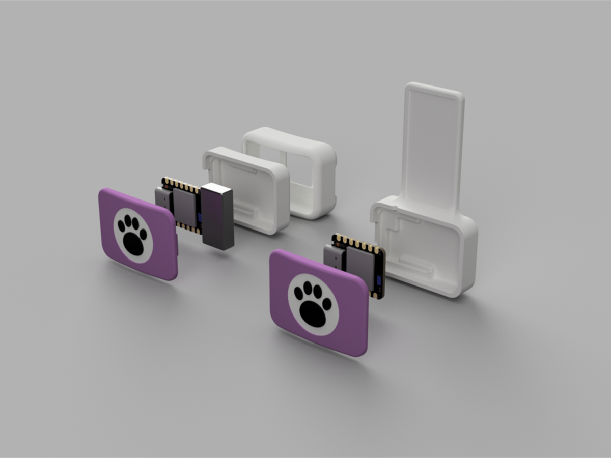
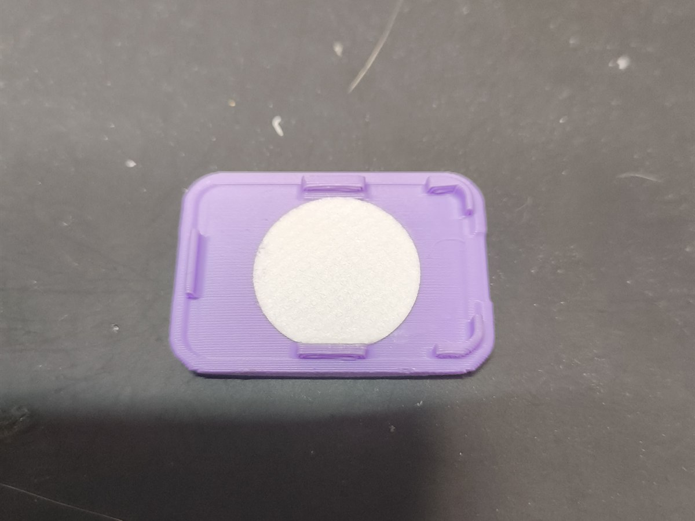
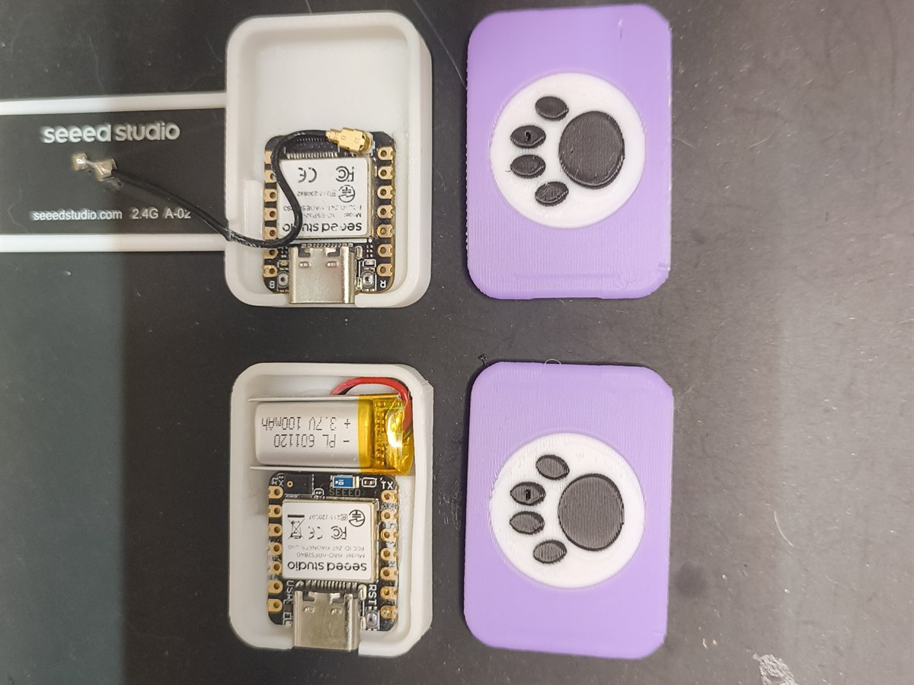
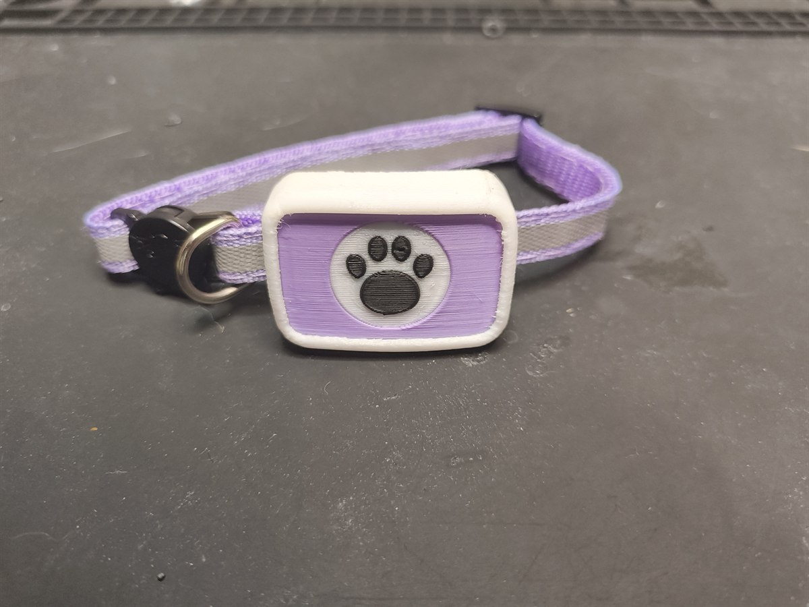
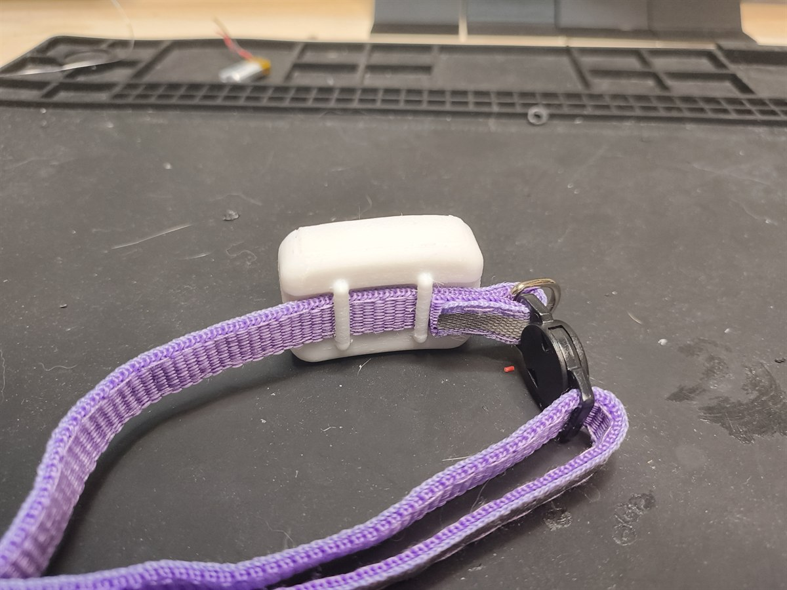

# Hardware

Everything physical for the two devices: the parts you need and how to print, assemble
and power them. There's no custom PCB, each device is a Seeed XIAO board in a 3D-printed shell.

- 3D print files are in [`3d-files/`](3d-files/). The front shell is shared between the
  collar and the station; the rest is per-device.
- Once it's built, flashing and first-time setup are in [`../firmware/`](../firmware/) and
  [`../docs/`](../docs/).

## Parts

### Collar (one per cat, battery, worn on the cat)
| Part | Qty | Notes |
|------|-----|-------|
| Seeed XIAO nRF52840 Sense | 1 | The brain. Onboard IMU + mic do all the sensing, no extra parts to wire. |
| 1S LiPo battery (3.7 V), 100 mAh, **with BMS/protection** | 1 | Powers the collar; solder to the BAT pads, mind polarity. Use a cell with a built-in protection circuit (BMS). |
| 20 mm hydrophobic PTFE filter membrane disc | 1 | Goes over the mic hole in the front shell: passes sound, keeps water and dust out. |
| 10 mm quick-release / safety collar | 1 | Any standard one; the silicone skin mounts to it. |

### Station (one per spot, mains powered, by the bowl)
| Part | Qty | Notes |
|------|-----|-------|
| Seeed XIAO ESP32-S3 | 1 | BLE + WiFi gateway: hears the collar, uploads to the cloud. |
| USB-C cable + 5 V supply | 1 | Mains powered, no battery. |

### Tools / consumables
| Item | Notes |
|------|-------|
| USB-C cable | Flash + set up both boards. |
| Filament | PETG (rigid shells), flexible TPU (collar skin). |
| Water-resistant glue | Bonds the shell halves and seals the assembly against splashes. |
| FDM 3D printer | A standard 0.4 mm nozzle is fine. |

## Print
| File | Used by | Filament |
|------|---------|----------|
| `front-shell.stl` | collar + station | PETG |
| `collar-back-shell.stl` | collar | PETG |
| `collar-silicone-skin.stl` | collar | flexible TPU |
| `station-back-shell.stl` | station | any rigid |

## Assemble

Both devices, exploded , the boards drop into the back shells and the front covers clip on:

### Collar
1. Seat the XIAO nRF52840 Sense + LiPo in the back shell.
2. Fit the 20 mm PTFE membrane over the mic hole on the inside of the front shell.
3. Close the front and back shells and bond them with water-resistant glue.
4. Slip the sealed assembly into the TPU skin and attach it to the quick-release collar.

| PTFE membrane over the mic hole | Boards seated in their shells |
|---|---|
|  |  |

### Station
1. Seat the XIAO ESP32-S3 in the shell.
2. Glue it closed with water-resistant glue.
3. Plug into USB power by the bowl.

## Finished collar

| Front | Back |
|---|---|
|  |  |

## Next
Flash both boards and register them, see [`../firmware/`](../firmware/) and [`../docs/`](../docs/).

## License
The hardware designs and 3D-print files in this directory are licensed under
[CERN-OHL-S v2](LICENSE) (strongly reciprocal). The repository's code is [MIT](../LICENSE).
Copyright (c) 2026 Jerome Graves and Rose Delcour-Min.
